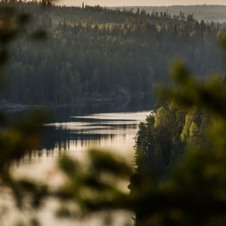

# Проект: Путешествие по России
 * [Russian-travel](https://vyacheslavkuznetso.github.io/Russian-travel/):
Цель данного проекта - продемонстрировать богатство природных ресурсов России, необыкновенное разнообразие ландшафтов и климатических зон, открывающих туристические возможности на любой вкус.
* [Ссылка на макет в Figma](https://www.figma.com/file/5S2WSbEFL6awjVWJ0NWL8Q/Sprint-3_-Russia-_-desktop-mobile?node-id=28503%3A0)
* В адаптивном проекте било применино техника Desktop First. Также, по мимо flexbox, использовались технология постраения сетки - Grig Layout. 

